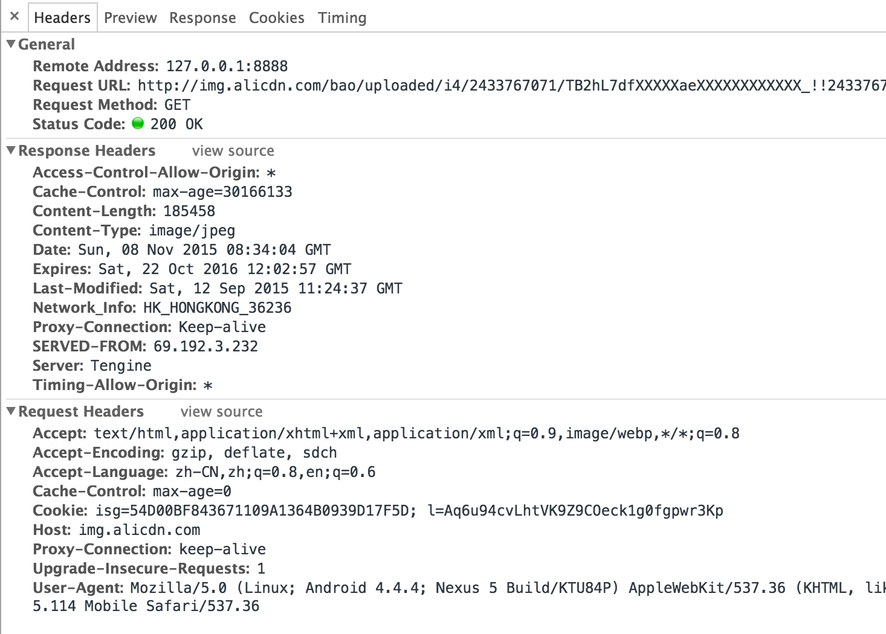
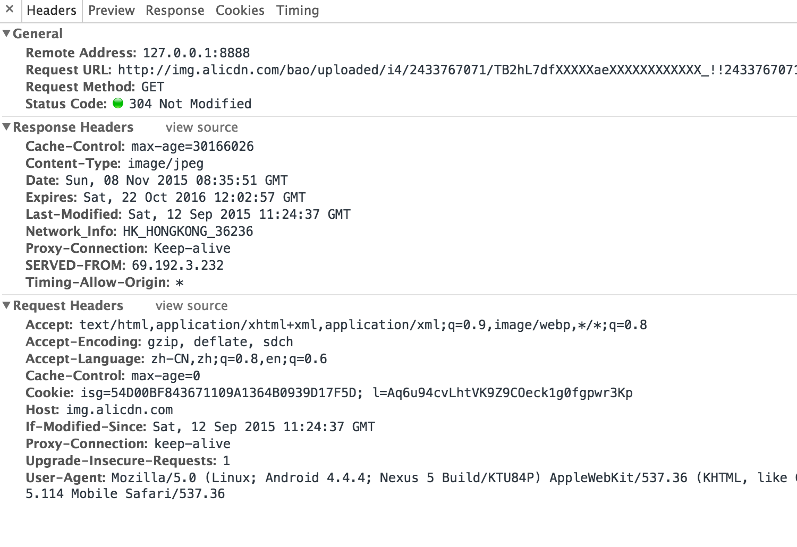
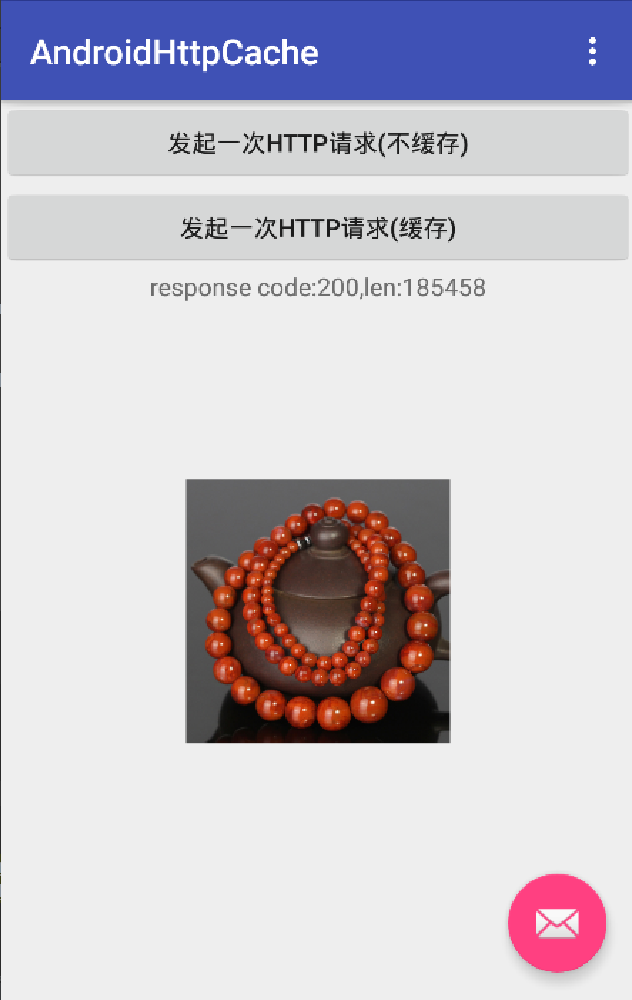

# AndroidHttpCache

>learn how to use http cache in android


## 概述

   `http Cache`指的是web浏览器所具有的复用本地已缓存的文档"副本"的能力。我们知道，通过网络获取内容有时候成本很高，因而
   缓存和重用以前获取的资源的能力成为优化性能很关键的一个方面。http协议本身提供了缓存的支持。

## 缓存的优势

    1. 减少冗余数据传输
    2. 缓解网络带宽瓶颈
    3. 降低距离时延
    4. 减少服务器负担

## http协议对缓存的支持

- Expires & Cache-Control
        
    >`Expires`响应首部给出了响应失效的绝对时间,这样,像浏览器这样的客户端就可以缓存一份副本,在这个时间到期之前,
    不用去询问服务器它是否有效了。http1.0引入。 例如:Expires: Thu, 03 Oct 1997 17:15:00 GMT
    
    >`Cache-Control`首部用于传输对象的缓存信息。http1.1引入。它的值是一个缓存指令，给出了与某个对象可缓存性有关的
    缓存特有指令。这个首部可以出现在请求或者响应头中。例如:Cache-Control: no-cache
    
    `Expires`和`Cache-Control`作用一致，都是指当前资源的有效期，控制浏览器是否直接从浏览器缓存获取数据还是重新发送
    请求到服务器取数据。
    
    `Cache-Control`可以设置如下值:
   
    (1)Request：
    
    - no-cache  ---- 不要读取缓存中的文件，要求向WEB服务器重新请求,http1.0时代还有pragma: no-cache，与此效果一样.
    - no-store    ---- 请求和响应都禁止被缓存
    - max-age： ---- 表示当访问此网页后的max-age秒内再次访问不会去服务器请求，其功能与Expires类似，只是Expires是根据某个特定日期值做比较。
    - max-stale  ---- 允许读取过期时间必须小于max-stale 值的缓存对象。 
    - min-fresh ---- 接受其max-age生命期大于其当前时间 跟 min-fresh 值之和的缓存对象
    - only-if-cached ---- 告知缓存者,我希望内容来自缓存，我并不关心被缓存响应,是否是新鲜的.
    - no-transform   ---- 告知代理,不要更改媒体类型,比如jpg,被你改成png.
   
    (2)Response：
   
    - public    ---- 数据内容皆被储存起来，就连有密码保护的网页也储存，安全性很低
    - private    ---- 数据内容只能被储存到私有的cache，仅对某个用户有效，不能共享
    - no-cache    ---- 可以缓存，但是只有在跟WEB服务器验证了其有效后，才能返回给客户端
    - no-store  ---- 请求和响应都禁止被缓存
    - max-age：   ----- 本响应包含的对象的过期时间
    - Must-revalidate    ---- 如果缓存过期了，会再次和原来的服务器确定是否为最新数据，而不是和中间的proxy
    - max-stale  ----  允许读取过期时间必须小于max-stale 值的缓存对象。 
    - s-maxage  ---- 与max-age的唯一区别是,s-maxage仅仅应用于共享缓存.而不应用于用户代理的本地缓存等针对单用户的缓存. 另外,s-maxage的优先级要高于max-age.
    - no-transform   ---- 告知代理,不要更改媒体类型,比如jpg,被你改成png.
  
    
    
>注意:`Expires`首部的值是绝对时间，容易受本地时钟偏差影响，而`Cache-Control`是相对时间。因而，`Cache-Control`的
优先级高于`Expires`
    
- 最优的`Cache-Control`策略
    

            
- ETag & If-None-Match

    >`ETag`告知浏览器当前资源在服务器的唯一标识符,由响应头携带
    
    > `If-None-Match`检查资源实体是否发生了改变,由请求头携带
    
    这两个首部通常结合使用。首先浏览器请求某个文档资源，服务端会对这个资源进行计算，生成指纹(md5或者其他..)，然后将指纹作为`ETag`令牌
    放到响应头中作为`ETag`的值发送给浏览器，浏览器收到响应后，将资源缓存。浏览器第二次访问此资源时，会先从缓存中寻找此资源，
    并将资源的`ETag`令牌作为`If-None-Match`请求头的值发往服务端，服务端拿到请求头后，将`If-None-Match`首部中包含的`ETag`
    令牌与该资源的指纹进行校验比对，如果没有发生变化，则返回304，告诉浏览器可以复用缓存，否则重新请求，并根据请求结果，
    返回200或者4xx。
     
-  Last-Modified & if-Modified-Since
    
    >`Last-Modified`首部提供资源最后一次被修改的日期，由响应头携带
    
    >`if-Modified-Since`首部检查资源是否在此时间后被修改过,由请求头携带
    
    这两个首部通常结合使用。首先浏览器请求某个文档资源，服务端找到该资源，并在响应头中加上`Last-Modified`标识该资源最近
    一次改动的时间，浏览器收到响应后，将资源缓存。浏览器第二次访问此资源时，会先从缓存中寻找此资源，并将资源的`last-Modified`
    的日期值作为`if-Modified-Since`首部的值发往服务器，服务端拿到请求头后，将'if-Modified-Since'的日期值与该资源最近
    一次改动时间进行比对，如果相同将直接返回304，说明可以复用该资源，否则重新请求，并根据请求结果，返回200或者4xx等。注：不是
    所有的浏览器都支持`if-Modified-Since`字段
    
    举个栗子，比如我访问这个图片:
   
    >http://img.alicdn.com/bao/uploaded/i4/2433767071/TB2hL7dfXXXXXaeXXXXXXXXXXXX_!!2433767071-0-paimai.jpg
    
    第一次请求和响应:
    
    
    
    第二次请求和响应:
    
   
    第一次请求因为本地没有缓存副本，所以没有携带`if-Last-Modified`请求头，而服务端会将资源最后修改时间通过`Last-Modified`
    返回，第二次因为缓存了副本，所以会携带`if-Last-Modified`.而且从响应码也能看出来，第一次是200，第二次是304。
 
>区分缓存命中还是未命中有点"困难"，因为http没有为用户提供一种手段来区分响应是缓存命中的，还是访问原始服务器得到的。
在这两种情况下，响应码都是200 ok。客户端有一种方法可以判断响应是否来自缓存，就是使用Date首部，将响应中Date首部的值
和当前事件进行比较，如果响应中的日期值比较早，客户端通常就可以认为这是一条缓存的响应，或者客户端也可以通过Age首部来检测
缓存的响应。

## android下的httpcache方案

- `HttpResponseCache`类,android4.0以后.

- `HttpResponseCache`兼容版,[https://github.com/candrews/HttpResponseCache](https://github.com/candrews/HttpResponseCache).
    
- 直接使用Square推出的`OkHttp`,google在4.0之后直接将`Okhttp`项目集成到了android项目中，作为`HttpUrlConnection`的实现引擎.
  而方案一中的`HttpResponseCache`也是依赖于`Okhttp`的，然而我们无法直接使用`Okhttp`因为它是`hide`的，使用的话需要单独依赖。
    

以android提供的`HttpResponseCache`为例说明。
我的代码演示了如何使用`HttpResponseCache`缓存一张网络图片，`NetworkUtils`类提供了`getBitmap`和`asyncGetBitmap`方法，用于获取
网络图片:

代码1:NetworkUtils#getBitmap()
```
public static HttpResponse getBitmap(Context context,Uri uri,Policy policy){
        if(uri == null){
            throw new IllegalArgumentException("uri is null");
        }
        installCacheIfNeeded(context);
        try {
            HttpURLConnection connection = (HttpURLConnection) new URL(MainActivity.URL).openConnection();
            connection.setConnectTimeout(DEFAULT_CONNECT_TIMEOUT);
            connection.setReadTimeout(DEFAULT_READ_TIMEOUT);

            if(policy == Policy.Cache){
                connection.setUseCaches(true);
            }else{
                connection.setUseCaches(false);
                connection.addRequestProperty("Cache-Control", "no-cache");
                connection.addRequestProperty("Cache-Control","max-age=0");
            }

            int contentLen = connection.getContentLength();
            int responseCode = connection.getResponseCode();
            HttpResponse response = new HttpResponse(responseCode,null,contentLen, BitmapFactory.decodeStream(connection.getInputStream()));
            connection.getInputStream().close();
            return response;
        } catch (IOException e) {
            e.printStackTrace();
        }
        return null;
    }
```

这里面我通过客户端的设定`Policy`来判断是否需要缓存图片，如果不需要就设置`no-cache`头。`installCacheIfNeeded`方法
用于初始化缓存,内部实际上调用了`HttpCache#install()`方法:


代码2:HttpCache#install()
```
static HttpResponseCache install(Context context) {
        if (context == null) {
            throw new IllegalArgumentException("context must not be null");
        }

        File cacheDir = new File(context.getApplicationContext().getCacheDir(), CACHE_DIR);
        if (!cacheDir.exists()) {
            cacheDir.mkdirs();
        }

        HttpResponseCache cache = null;
        if (Build.VERSION.SDK_INT > Build.VERSION_CODES.ICE_CREAM_SANDWICH) {
            try {
                if ((cache = HttpResponseCache.getInstalled()) != null) {
                    return cache;
                }
                cache = HttpResponseCache.install(cacheDir, CACHE_SIZE);
            } catch (IOException e) {
                e.printStackTrace();
                Log.e(TAG, "http response installation failed,code = 0");
            }
        } else {
            try {
                if ((cache = (HttpResponseCache) Class.forName("android.net.http.HttpResponseCache").getMethod("getInstalled").invoke(null)) != null) {
                    return cache;
                }
                Method method = Class.forName("android.net.http.HttpResponseCache").getMethod("install", File.class, long.class);
                cache = (HttpResponseCache) method.invoke(null, cacheDir, CACHE_SIZE);
            } catch (Exception e) {
                e.printStackTrace();
                Log.e(TAG, "http response installation failed,code = 1");
            }
        }
        return cache;
    }
```

我在MainActivity中编写了一个测试用例来分别测试了允许缓存和不允许缓存情况下的结果。加载的图片来自阿里cdn图片服务器，
这里的图片的过期时间是一年，所以可以确保能够缓存。

```
Cache-Control:max-age=31536000
Content-Type:image/jpeg
Date:Thu, 22 Oct 2015 05:41:18 GMT
Expires:Fri, 21 Oct 2016 05:41:18 GMT
```

测试结果很完美，在允许缓存的情况下，只需要第一次请求server，拿到数据后会缓存到本地预设的目录，以后的请求都会直接走
缓存.




我们来观察下缓存的数据格式，这里我预先设定了缓存目录位于包名`/cache/http/`下(相关代码参考HttpCache.java)，ddms打开这个
目录，pull出来，发现三个文件，其中有个叫journal的，很显然，这是使用了`DiskLruCache`类,另外两个文件有一个大小是185458字节，
肯定是这张图片，另一个文件用sublime打开后内容如下：

```
http://img.alicdn.com/bao/uploaded/i4/2433767071/TB2hL7dfXXXXXaeXXXXXXXXXXXX_!!2433767071-0-paimai.jpg
GET
0
HTTP/1.1 200 OK
18
Server: Tengine
Content-Type: image/jpeg
Content-Length: 185458
Connection: keep-alive
Date: Thu, 22 Oct 2015 05:41:18 GMT
Last-Modified: Sat, 12 Sep 2015 11:24:37 GMT
Expires: Fri, 21 Oct 2016 05:41:18 GMT
Cache-Control: max-age=31536000
Access-Control-Allow-Origin: *
Via: cache7.l2cm12[0,200-0,H], cache60.l2cm12[16,0], cache1.cn406[0,200-0,H], cache8.cn406[1,0]
Age: 1501380
X-Cache: HIT TCP_MEM_HIT dirn:2:377253066
X-Swift-SaveTime: Sun, 08 Nov 2015 03:15:26 GMT
X-Swift-CacheTime: 30075952
Timing-Allow-Origin: *
X-Android-Sent-Millis: 1446993858366
X-Android-Received-Millis: 1446993858403
X-Android-Response-Source: NETWORK 200
```
这其实是一个响应头，`X-Android-Response-Source`首部是由othttp追加的，可以判断响应数据是从disk cache拿的还是
从网络拿的。代码如下:
```
//返回true说明从缓存拿的
static boolean parseResponseSourceHeader(String header) {
    if (header == null) {
      return false;
    }
    String[] parts = header.split(" ", 2);
    if ("CACHE".equals(parts[0])) {
      return true;
    }
    if (parts.length == 1) {
      return false;
    }
    try {
      return "CONDITIONAL_CACHE".equals(parts[0]) && Integer.parseInt(parts[1]) == 304;
    } catch (NumberFormatException e) {
      return false;
    }
  }

```
通过`parseResponseSourceHeader(connection.getHeaderField("X-Android-Response-Source"))`即可判定.


    
##参考资料:

1. [HTTP协议探索之Cache-Control](http://blog.csdn.net/chen_zw/article/details/18924875)
2. [HTTP 缓存](https://developers.google.com/web/fundamentals/performance/optimizing-content-efficiency/http-caching?hl=zh-cn)
3. [HttpResponseCache](http://developer.android.com/intl/zh-cn/reference/android/net/http/HttpResponseCache.html)